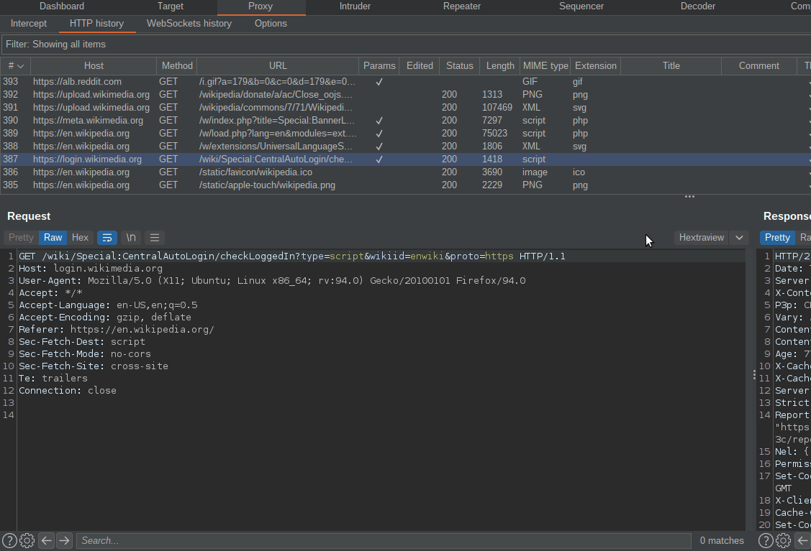

# Hextraview

Hextraview is a mere attempt at bringing a better hex editor in Burp Suite. This idea took root following very popular demand (i.e. 3 people on a lost IRC channel).



## Features

### Hex Editor
- Full hex editing with undo/redo support (Ctrl+Z / Ctrl+Y)
- Multiple view modes: Dual (hex + text), Hex only, Text only
- Configurable bytes per line and character encoding
- Insert and Overwrite edit modes

### Search & Replace
- Text and hex pattern search (Ctrl+Shift+F)
- Regular expression support with capture groups
- Find and replace functionality
- Case-sensitive search option

### Context Menu (Right-click)
- **Copy**: Raw text, Hex (`48 65 6C 6C 6F`), C Array (`\x48\x65...`), Base64
- **Paste**: Raw text, Hex, Base64 decode
- **Paste in Body**: Insert content in HTTP body region only
- **Go to Offset**: Navigate to specific position (Ctrl+G)

### HTTP-Aware Coloring
- Automatic detection of HTTP structure (request line, headers, body)
- Distinct background colors for each HTTP region
- Character type highlighting (printable, null bytes, unprintable, spaces)

### Themes
Multiple built-in themes: Light, Dark, High Contrast, Monokai, Solarized (Dark/Light), Matrix, Dracula, Ocean, Retro

### Settings
- Persistent color and theme preferences
- Import/Export settings as JSON
- Per-character type color customization

## Installation

1. Download the latest `hextraview-x.x.x.jar` from [Releases](../../releases)
2. In Burp Suite: Extensions > Add > Select the JAR file
3. The "Hextraview" tab will appear in HTTP message editors and WebSocket message editors

## Development

### Prerequisites
- Java 17 or higher
- Gradle 7+
- Burp Suite (2023.x or later for WebSocket support)

### Building from Source

```bash
gradle build
```

The built JAR will be in `build/libs/hextraview-x.x.x.jar`

### Project Structure

```
src/burp/
├── BurpExtender.java          # Legacy API extension entry point
├── HextraViewMontoya.java     # Montoya API entry point (WebSocket support)
├── ViewStateTab.java          # HTTP message editor tab
├── WebSocketHexTab.java       # WebSocket message editor tab
├── DeltaHexPanel.java         # Main hex editor panel
├── HexviewCodeArea.java       # Custom CodeArea with undo/redo
├── HextraCodeAreaPainter.java # Color styling
├── SearchPanel.java           # Search/replace functionality
├── HexContextMenu.java        # Right-click context menu
├── HexUtils.java              # Hex conversion utilities
└── SettingsManager.java       # Settings persistence
```

See [CONTRIBUTING.md](CONTRIBUTING.md) for development guidelines.

## Keyboard Shortcuts

| Shortcut | Action |
|----------|--------|
| Ctrl+Z | Undo |
| Ctrl+Y | Redo |
| Ctrl+Shift+Z | Redo (alternative) |
| Ctrl+Shift+F | Open search panel |
| Ctrl+G | Go to offset |
| Ctrl+A | Select all |
| Ctrl+C | Copy |
| Ctrl+V | Paste |

## Project History

- March 2021: 30 minutes looking for existing opensource java hex library
- May 2021: 5 minutes spent to push the lib basis example into a view
- November 2021: Nothing has changed let's put it in a corner of GitHub
- December 2025: v1.1.0 - Major update with bined library, search/replace, context menu, themes (vibe coded)
- February 2026: v1.3.0 - Fix theme initialization NPE, WebSocket message editor support via Montoya API, Java 17 baseline

## Todo / Requests

PR are more than welcome ;)

## License

GPLv3 - See [LICENSE](LICENSE) file.

Note: This project uses the [bined](https://github.com/exbin/bined) library which is licensed under Apache License 2.0.
